# Enunciado original — EXAMEN ODOO

> Transcripción literal del archivo `EXAMEN_ODOO.docx` entregado por el empleador.
> Las capturas referenciadas están en `media/`. Fueron tomadas en una versión antigua de Odoo
> (v12, interfaz morada); el desarrollo se hace en **Odoo 17**, adaptando la ubicación de los
> elementos cuando la interfaz cambió. Ver `../../CLAUDE.md` para la interpretación acordada.

**Guía de capturas**
- `image3.png`  → punto 1: menú raíz **Datos** → submenú **Datos de los pacientes** → ítem **Tipo de Sangre**.
- `image12.png` → punto 2: vista lista con una sola columna **Tipo** y 8 registros (O+, O-, A+, A-, B+, B-, AB+, AB-).
- `image8.png`  → punto 2: vista formulario con campos **Tipo** y **Activo** (checkbox).
- `image11.png` → punto 3: campo **Tipo de Sangre** (desplegable Many2one) en el encabezado de la factura, bajo Fecha de vencimiento.
- `image1.png`  → punto 4: botón **Comentario** en la barra de botones, después de **Registrar pago**, factura en estado Abierto.
- `image5.png`  → punto 5: pop-up titulado **Tipo de sangre**, h1 **TIPOS DE SANGRE RESTANTES**, texto "Por favor elegir los tipos de sangre a continuación:", tres desplegables (*Tipo sangre restante*, *Tipos de sangre restante (+)*, *Tipos de sangre restantes (-)*), botones **Actualizar comentario** y **Anular operación**.
- `image6.png`, `image4.png`, `image7.png` → punto 5: contenido filtrado de cada desplegable.
- `image9.png`  → punto 5: ejemplo de selección.
- `image10.png` → punto 6: comentario resultante al pie de la factura.
- `image2.png`  → punto 6 (JS): diálogo **Edicion fecha de factura**, h1 **FECHA DE FACTURA**, input de fecha, botones **Guardar** / **Cancel**.

---

**EXAMEN ODOO**

**[CREACIÓN DE MÓDULOS NUEVOS]{.underline}**

1\) CREAR UN MENU TAL Y COMO SE MUESTRA A CONTINUACIÓN:

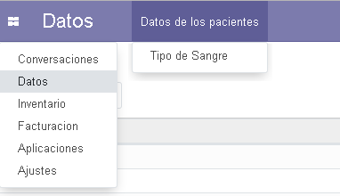

2\) CREAR UN MODELO QUE PERMITA ALMACENAR LOS TIPOS DE SANGRE. LAS
VISTAS TREE Y FORM SE MUESTRAN A CONTINUACIÓN:
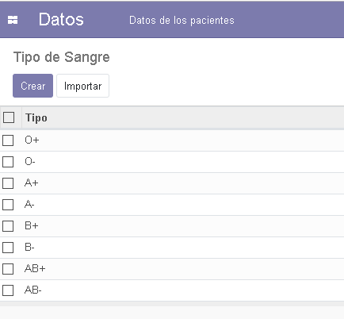

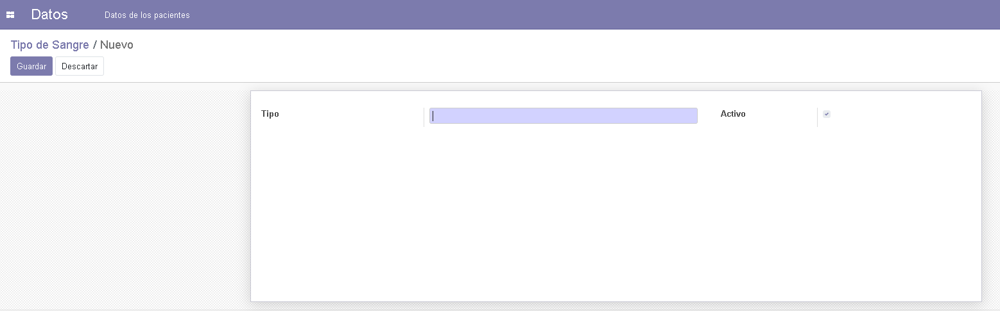

**[HERENCIA]{.underline}**

3\) HEREDAR EL MÓDULO DE FACTURACIÓN Y COLOCAR UN MENU DESPLEGABLE CON
LA DATA ALMACENADA EN NUESTRO MODELO (SE DEBE COLCOAR ENTRE FECHA DE
VENCIMIENTO Y VENDEDOR). AL VALIDAR LA FACTURA, EL CAMPO YA NO SE DEBE
DE PODER EDITAR:

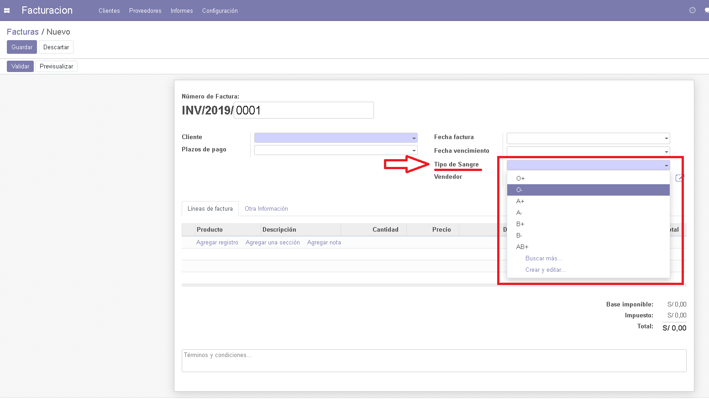

4\) SOLO CUANDO LA FACTURA ESTÁ EN ESTADO "ABIERTO" DEBE APARECER UN
BOTON QUE DIGA "COMENTARIO" (SE DEBE COLOCAR DESPUES DE REGISTRAR PAGO):

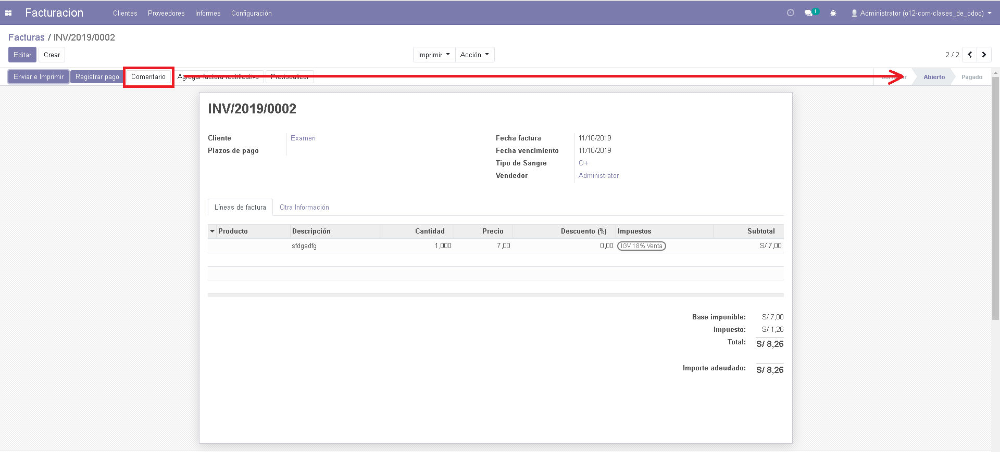

**[VISTAS, ACCIONES Y FUNCIONES]{.underline}**

5\) AL HACER CLICK EN EL BOTON COMENTARIO, DEBE APARECER UN POP UP COMO
SE MUESTRA A CONTINUACIÓN:

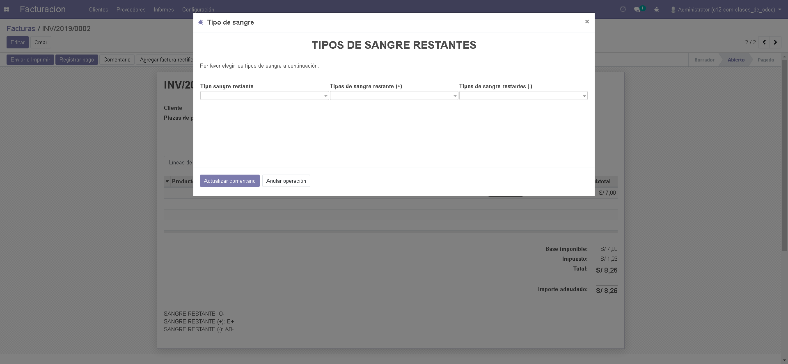 

EN TIPO DE SANGRE RESTANTE DEBEN APARECER TODOS LOS TIPOS DE SANGRE,
EXCEPTO EL QUE SE SELECCIONÓ EN LA FACTURA (EN EL EJEMPLO DEL PASO 4, SE
SELECCIONO O+):

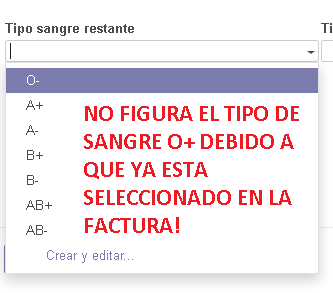

EN TIPO DE SANGRE RESTANTE (+) DEBEN APARECER TODOS LOS TIPOS DE SANGRE
POSITIVOS. EN CASO EN LA FACTURA SE HAYA SELECCIONADO UN TIPO DE SANGRE
POSITIVO, ESTE DEBERÁ SER EXCLUIDO (EN EL EJEMPLO DEL PASO 4, SE
SELECCIONO O+):

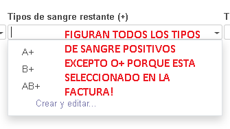

EN TIPO DE SANGRE RESTANTE (-) DEBEN APARECER TODOS LOS TIPOS DE SANGRE
NEGATIVOS. EN CASO EN LA FACTURA SE HAYA SELECCIONADO UN TIPO DE SANGRE
NEGATIVO, ESTE DEBERÁ SER EXCLUIDO (EN EL EJEMPLO DEL PASO 4, SE
SELECCIONO O+):

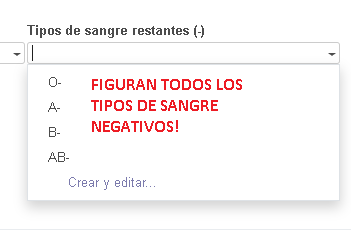

PARA ESTE EJEMPLO SE HAN SELECCIONADO LOS SIGUIENTES TIPOS DE SANGRE:

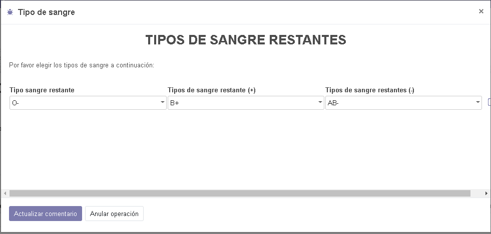

6\) AL HACER CLICK EN EL BOTON "ACTUALIZAR COMENTARIO" DEL POP UP, SE
DEBERÁ AGREGAR UN COMENTARIO EN LA FACTURA CON LA SIGUIENTE ESTRUCTURA
(EL COMENTARIO DEBE VARIAR SEGÚN LO QUE SE SELECCIONE EN EL POP UP, A
CONTINUACIÓN SE MUESTRA UN EJEMPLO):

[SANGRE RESTANTE: O-\
SANGRE RESTANTE (+): B+\
SANGRE RESTANTE (-): AB-]{.mark}

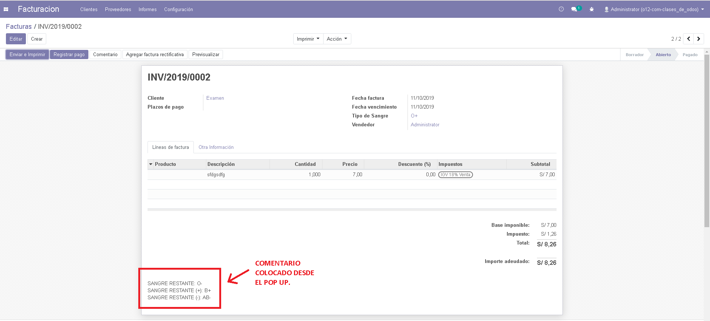

6\) Crea un Wizard de tipo JS donde solicitaras solo el dato de la fecha
de factura y permita actualizar la informacion utilizando rpc.query.

El contenido del wizard debe ser un titulo del campo en h1 y un input de
tipo fecha

\
\
7) Agrega un botón en el formulario que permita descargar un pdf los
datos
